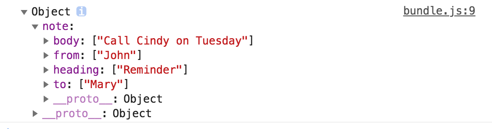

# webpack-demo

此部分对应管理资源部分（加载数据）

我们使用npm安装了csv-loader和xml-loader，为处理CSV、TSV 和 XML文件

我们修改了webpack.config.js文件，引入csv-loader和xml-loader，用来解析CSV、TSV 和 XML文件

我们新增了一个名为data.xml的文件，同时，在index.js中使用此文件

最后，运行npm run build 命令，查看效果

> 打开index.html，我们可以看到Hello webpack，文字的颜色变成了红色，且有背景图片出现，文字字体也发生了变化

> 请注意这里XML文件并未被压缩，大小没变，也就是说，webpack默认是不会压缩文件大小的

> 注意看控制台打出的数据



xml格式的数据被转换成了对象，xml标签对应为key，xml标签里面的值对应成了数组

##

我们先来看下一个TAG(V3.1)

在命令行 / 终端输入以下命令

```bash
git checkout v3.1
```


